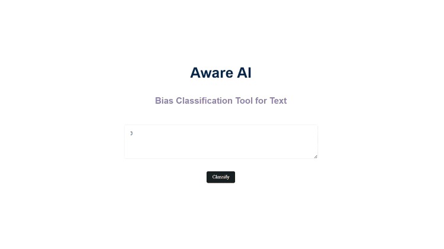

# Abstract
Large language models (LLMs) have demonstrated impressive generative capabilities but also carry the risk of encoding sociocultural biases. This study explores bias detection in story generation by language models. We use GPT-3.5 to automatically generate a dataset of 800 stories, divided equally between English and Arabic, comprising biased and unbiased examples across different categories. Leveraging this dataset, we conduct two experiments:

1. **Bias Classification by GPT-3.5**: We use GPT-3.5 to classify bias in its own generated stories, revealing limitations in recognizing inherent biases.
2. **Fine-Tuning GPT-2 as a Bias Classifier**: We fine-tune GPT-2 as a dedicated bias classifier, achieving 97.5% accuracy on unseen data.

Our findings highlight the gap between the generation and classification capabilities of language models and underscore the need for task-specific training to enhance bias analysis.

## Model Availability
The model is available [here](https://drive.google.com/file/d/1JwVkjEl_8SFYqsSEfPlIJHehRgR2IyO6/view?usp=sharing).

## Demo

### Installation and Running the Demo

1. **Install Requirements**
    ```bash
    pip install -r requirements.txt
    ```

2. **Run the Demo**
    ```bash
    python app.py
    ```

3. **Access the Application**
    Open your browser and go to:
    ```
    http://127.0.0.1:5000/
    ```

## Implementation Note
This work utilizes the implementation of a News Classifier described in [Cai’s work](https://github.com/haocai1992/GPT2-News-Classifier).
